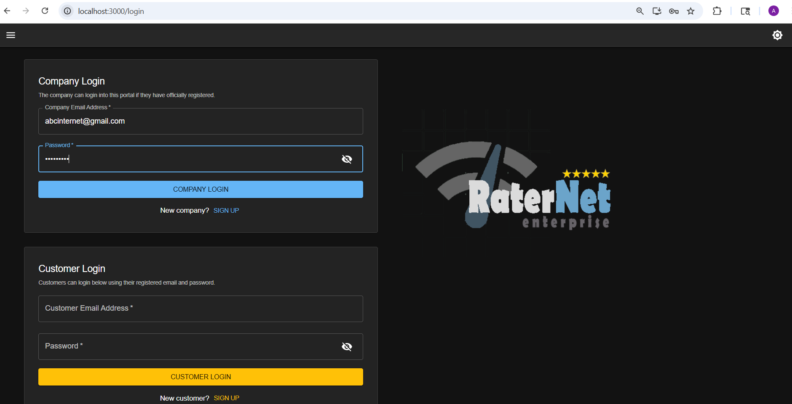
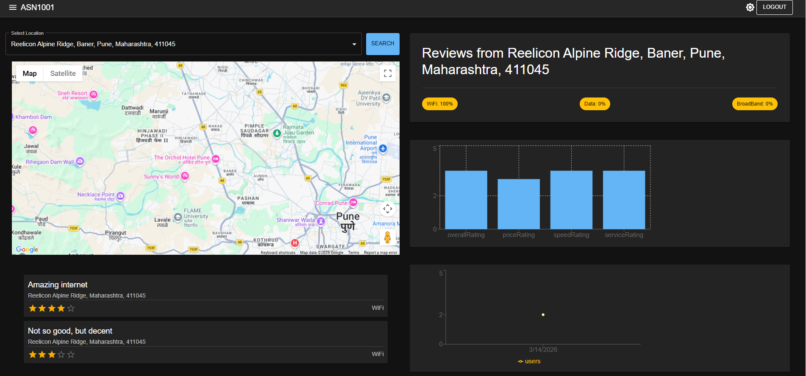
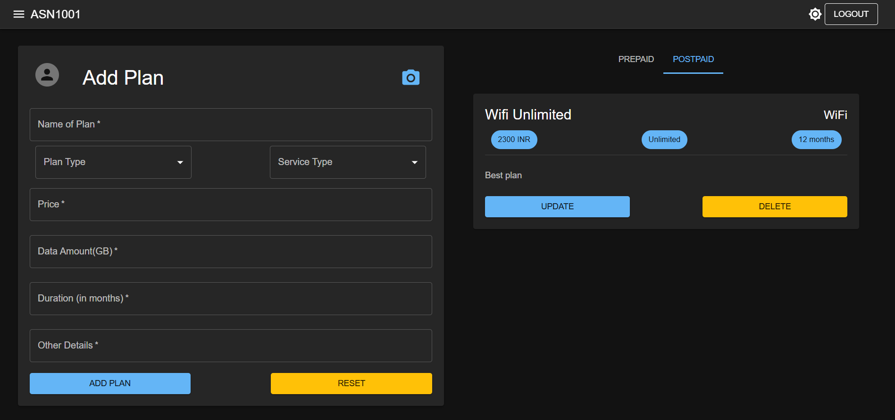
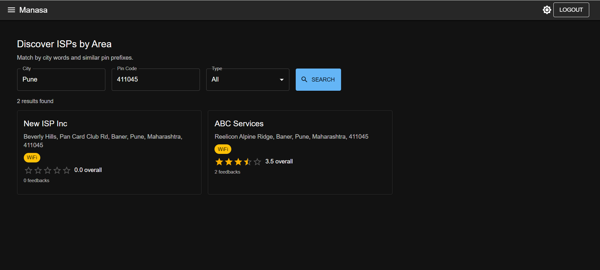
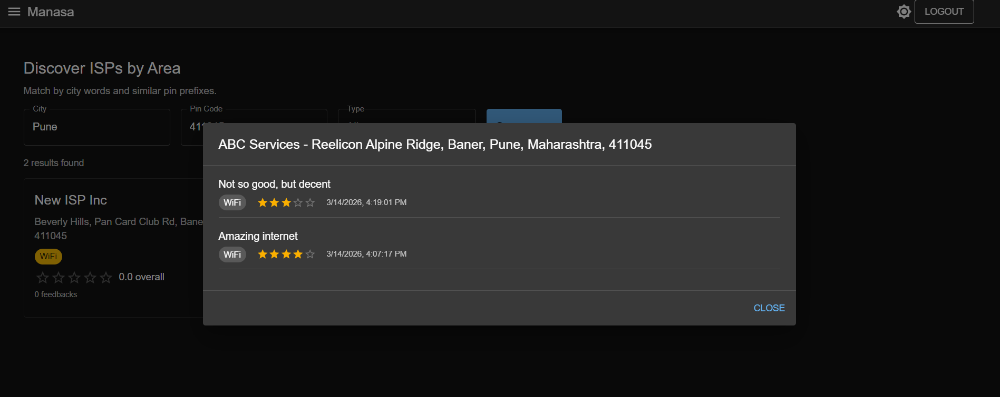
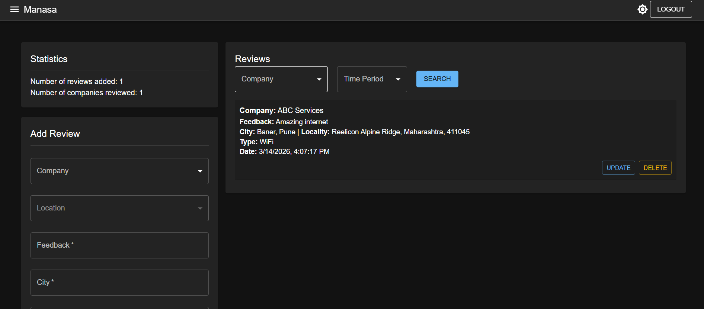

# RaterNet

Raternet is a platform that helps customers discover the best Internet Service Providers (ISPs) in their area. Users can explore ISPs by location, compare plans and services, read reviews from other customers, and add their own reviews based on their experiences.

For ISPs, Raternet offers a dashboard to track reviews across locations, plans, and services, providing visual insights that help providers understand customer feedback and improve their offerings.

## Tech Stack

- Backend: Node.js, Express, MongoDB
- Frontend: React 

## Execution Output

### Main Company Flows

#### 1. Login Page



#### 2. Company Dashboard



#### 3. Add Plans



### Main Customer Flows

#### 1. Customer Dashboard (Find ISPs in given area)



#### 2. Customer - Check all reviews of the (Company, location) pair



#### 3. Customer - Add reviews



## Setup

### 1. Prerequisites

Install these first:
- Node.js 16+ (recommended Node.js 18 LTS)
- npm 8+
- MongoDB (local) or MongoDB Atlas connection string
- Git

Optional for mobile app:
- Android Studio + JDK 11+

### 2. Clone And Open

```powershell
git clone <your-repo-url>
cd RaterNet
```

### 3. Backend Setup

#### 3.1 Install dependencies

```powershell
cd backend
npm install
```

#### 3.2 Configure environment

Edit `backend/config.env` and set your values:
- `DATABASE` (Mongo connection string with `<PASSWORD>` placeholder)
- `DATABASE_PASSWORD`
- `JWT_SECRET`
- `JWT_EXPIRES_IN`
- `JWT_COOKIE_EXPIRES_IN`

Example:

```env
NODE_ENV=development
PORT=7000
DATABASE=mongodb+srv://<user>:<PASSWORD>@cluster0.xxxxx.mongodb.net/test?retryWrites=true&w=majority
DATABASE_PASSWORD=your_db_password
JWT_SECRET=your_super_secret_key
JWT_EXPIRES_IN=7d
JWT_COOKIE_EXPIRES_IN=7
```

#### 3.3 Start backend server

```powershell
npm start
```

Backend should run at: `http://localhost:7000`

### 4. Frontend Setup

Open a new terminal:

```powershell
cd frontend
npm install
```

Create/update `frontend/.env`:

```env
REACT_APP_API_URL=your_google_maps_api_key
```

Start frontend:

```powershell
npm start
```

Frontend should run at: `http://localhost:3000`

### 5. Run The App

Option A (from project root):

```powershell
cd RaterNet
npm run dev
```

Option B (separate terminals):

1. Start backend first (`backend` terminal: `npm start`)
2. Start frontend next (`frontend` terminal: `npm start`)
3. Open `http://localhost:3000`
4. Sign up / log in as:
	 - Company user
	 - Customer user

### 6. Troubleshooting

- If backend exits immediately:
	- Check values in `backend/config.env`
	- Verify MongoDB is reachable
- If frontend cannot call backend:
	- Confirm backend is running on port `7000`
	- Confirm no proxy/firewall blocks localhost
- If maps do not load:
	- Verify `REACT_APP_API_URL` contains a valid Google Maps API key
- If login works but wrong page opens:
	- Clear local storage and log in again

### 7. Suggested Development Workflow

```powershell
# Single command from project root
cd RaterNet
npm run dev
```

You can also run backend and frontend in separate terminals if preferred.
